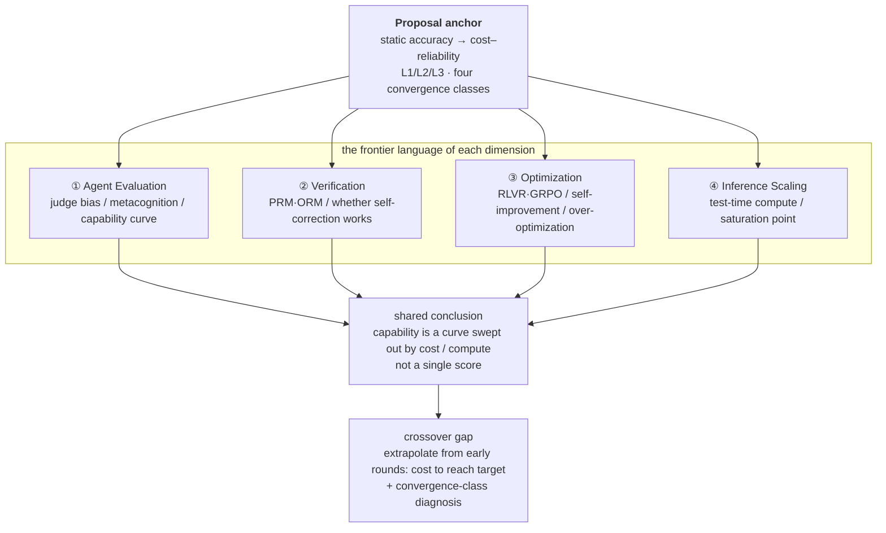

# Metacognitive Agent Evaluation — Academic Frontier Work Map

> Report type: literature frontier map · Generated 2026-09-26 · Anchored to draft 2026-09-19 · 33 sources
>
> Anchored to the proposal *Can You Teach an Agent to Know What It Doesn't Know?* — mapping the 2022–2026 frontier along four dimensions: **Agent Evaluation / Verification / Optimization / Inference Scaling**.

The four dimensions have each converged, over 2024–2026, onto the same language — **"capability is a curve swept out by cost/compute, not a single score."** But the *crossover question* — "predict from early rounds the cost required to reach a target accuracy + diagnose the convergence class" — has not yet been systematically covered by anyone. This is precisely the gap where the proposal lands and can make an original contribution.

---

## 1. Proposal anchor: mapping the "five reframes" to the frontier

The fixed point of the proposal is not any specific algorithm but five independently testable reframes. The four-dimensional frontier map below uses these five reframes as coordinates to locate "what others have already done, and what is still missing."

**Five reframes to map**

- **Reframed evaluation object**: from static accuracy ("what is the accuracy?") to cost–reliability ("given a target accuracy, what is the expected cost of reaching it?").
- **Three-layer capability hypothesis**: L1 base (the latent ceiling of single-sample raw accuracy) / L2 augmentation (tool use, retrieval, orchestration, multi-sample voting, best-of-N) / L3 metacognition (self-monitoring, receiving external signals and self-correcting on that basis).
- **External metacognitive proxy**: an error classifier + Top-K directional feedback (without leaking the gold answer) + conservative updates (a Bayesian flavor, guarding against over-correction and oscillation) + a bounded feedback–self-correction loop.
- **Four convergence classes**: convergent / oscillating / divergent / stagnant. Convergence is "a property of model capability under feedback," not a property of a single question.
- **Three mathematical framings**: A stochastic approximation (Robbins–Monro type) / B Markov chain + stationary distribution (Gelman–Rubin R̂) / C sequential analysis + stopping time.

Accordingly, judging whether a frontier work is "relevant to this proposal" reduces to asking which of the five reframes it touches: does it support, extend, or already solve the crossover problem the proposal targets. The four sections below answer that question in turn.

## 2. Four-dimension frontier map (overview)

The logic of the diagram: the proposal anchor (top) splits downward into four dimensions; each dimension independently converges to the same conclusion — "capability is a function of cost/compute"; and the cell below that conclusion, where the four lines overlap but no one has filled it in, is the proposal's entry gap.

*Figure 1 · Overview of the relationship between the four frontier dimensions and the proposal's gap. All four dimensions jointly push the "static score" toward the "capability curve," but the cell of "early extrapolation + convergence diagnosis" remains empty.*

## 3. Dimension ① Agent Evaluation and metacognition

### 3.1 From "single completion score" to "capability curve"

The evaluation paradigm is shifting from a "single task-completion score" to curves and multiple dimensions. This shift is **fully in phase** with the proposal §1.1 judgment that "static accuracy hides two layers of uncertainty," and it has already been empirically confirmed by an independent body: the UK AISI explicitly changed capability from a single score to a **capability curve** — an evaluation whose tested budget is truncated early yields a reported score that is only a **lower bound, not an upper bound**, on capability [3]. Its cyber-task evaluation further shows that frontier models can effectively use token budgets **10–50× larger** than industry-standard settings, and roughly 8% of tasks are solved for the first time only when the budget reaches ≥10M tokens [4]. This directly substantiates the proposal's claim that "problem-boundary uncertainty" (steps / budget / tools) materially changes the judgment of "can" vs "cannot."

### 3.2 Uncertainty in the evaluation scale: LLM-as-a-Judge bias

The proposal's "same-source / self-verification bias" has already been systematically measured: LLM-as-a-Judge exhibits **position bias, verbosity bias, and self-preference bias**, and tends to give higher scores to outputs from models of the same family [2]. This turns "uncertainty in the evaluation scale" from a philosophical concern into a measurable engineering variable — a judge giving different scores to the same question under different candidate orderings corresponds exactly to the proposal's argument that "reporting a single number can be misleading."

### 3.3 "Knowing what you don't know": from intrinsic confidence to trainable refusal

The early landmark work on "does a model know what it doesn't know" comes from Kadavath et al.'s calibration study: there is a measurable, and unreliable, gap between an LLM's confidence in its own answers and actual correctness [1]. The latest evolution of this line turns "refusal / non-answer" from a failure into a trainable signal: Reinforced Hesitation changes RLVR's binary reward into a ternary one (correct +1, refuse 0, wrong −λ), thereby obtaining a family of models along a Pareto frontier from "aggressive answering ↔ conservative refusal" [28]. This work is highly relevant to the proposal's L3 (metacognition): it proves that "say you don't know when uncertain" is not a prompt trick but a capability that can be shaped by reward — yet it is the **reinforcement of intrinsic confidence**, and has not yet reached the proposal's step of "an external proxy injecting structured feedback."

> **① Relation to the proposal** — Dimension ① has already consolidated "static score → capability curve" and "judge bias" into mature facts, but "metacognition" remains at the stage of intrinsic confidence — the proposal's "external metacognitive proxy" is one step further along this line.

## 4. Dimension ② Verification and self-correction

### 4.1 Verifiers: from answer-level to process-level, then to "first-error localization"

The verifier lineage has stabilized into a clear spectrum: Self-Consistency uses "majority voting over multiple reasoning paths" to provide an aggregate judgment independent of human labels [6]; Lightman et al. advance the reward from answer-level (ORM) to step-level (PRM), letting models expose wrong directions mid-reasoning [7]; Math-Shepherd uses a Completer to expand intermediate steps and counts the final hit rate, automatically constructing process supervision **without human annotation** [8]. Chain-of-Verification gives a structured feedback template of "draft → plan verification questions → independently verify → revise" [5]. These are precisely the reusable infrastructure for the proposal's "error classifier + Top-K directional feedback" — especially the "direction-aware feedback without leaking answers" positioning of PRM and Math-Shepherd, which is nearly isomorphic to the proposal's requirement of "not leaking the gold answer."

### 4.2 Does self-correction work? A settled controversy that is strongly tied to the proposal

This is the line most deeply related to the proposal among the four dimensions. Huang et al. (2023) provide the key counterexample: **without external feedback, an LLM's intrinsic self-correction is limited and can even change a correct answer into a wrong one** [9]. The subsequent self-correction survey (2024) converges the controversy on an actionable conclusion: LLMs can improve "given reliable feedback," but **"generating reliable feedback on its own" is the bottleneck** — only when verification is simple enough does "recognizing the error" become easier than "avoiding the error" [10]. The *Dark Side* study further reveals that self-correction induces **internal answer wavering**, thereby turning right answers into wrong ones [11]; a finer decomposition breaks self-correction into three sub-capabilities — **error detection → error localization → error correction** — and measures the failure point of each step separately [13]; Confidence vs. Critique decomposes self-correction into two independent components, "confidence in already-correct answers" vs "turning wrong answers into right ones" [12].

These conclusions provide **direct support** for the proposal: first, "external feedback is needed rather than purely intrinsic self-correction" has been established by the field itself (this is why the proposal externalizes the signal); second, "intrinsic self-correction wavers / flips" is the entire motivation for the proposal's "conservative updates + anti-oscillation"; third, decomposing self-correction into "detection–localization–correction" is structurally a mirror image of the proposal's "error classifier + Top-K direction."

### 4.3 Engineering paradigms for iterative revision

Self-Refine proves that the same model can "generate → self-feedback → iteratively revise" without extra training data [14]; Reflexion writes failure feedback as natural-language reflections stored in memory for later retries [15]; CRITIC proves that **tool-interactive verification feedback** yields more stable self-correction than pure self-reflection [16]. Together the three delimit the proposal's "feedback–self-correction loop" operating space: feedback should be structured, verifiable, and preferably from external tools.

> **② Relation to the proposal** — Dimension ② has established "external feedback is necessary, intrinsic self-correction oscillates easily," but its conclusions are **qualitative** ("does it work"), and do not answer the **trajectory-level** quantitative question of "whether, and to what height, multi-round feedback converges" — which is exactly the proposal's core.

## 5. Dimension ③ Optimization (RL alignment / self-improvement)

The alignment route has moved from "learning a reward model" to "using verifiable signals." DeepSeek-R1 shows that under **pure reinforcement learning** + verifiable rewards, a model can spontaneously exhibit long-chain reasoning and self-verification behaviors [20]. A theoretical line on GRPO/RLVR formulates "verifiable-reward RL" as a KL-regularized contrastive loss and has begun discussing **fixed points of the iterative dynamics and "success amplification"** [22]. The self-improvement direction has seen two generations: Self-Rewarding has the model score itself with an LLM-as-a-Judge and iteratively apply DPO [23], and Meta-Rewarding further has the model "judge its own judgments" to calibrate the feedbacker [24]; Constitutional AI represents the earlier practice of "replacing part of the human-preference signal with natural-language principles" [33].

For the proposal, dimension ③ offers **philosophical isomorphism rather than direct components**: the proposal does not optimize L1/L2 but constructs an external signal system to "test whether a model can exploit it" — this shares the same worldview as RLVR's "verifiable reward as a training signal," but the proposal uses the signal for **diagnosis**, not training. At the same time, reward hacking / over-optimization (the Goodhart effect) and the risk of self-training degradation are exactly the counterparts, in this dimension, of the proposal's "conservative updates to prevent divergence" — if a reinforcement signal is not bounded, trajectories can diverge, which corroborates, from the reverse side, the value of "convergence-class diagnosis."

> **③ Relation to the proposal** — Dimension ③ proves "structured verifiable signals can drive transformation / emergence," but all of it serves **training**; using the same signal system to **measure and diagnose convergence** remains an empty slot.

## 6. Dimension ④ Inference Scaling / Test-time Compute (closest to the proposal's core)

### 6.1 The big thesis: compute can be moved from "training" to "inference"

Snell et al. (2024) first showed that, at matched compute, **optimally scaling test-time compute can match or even exceed scaling model parameters**, and that the effectiveness of different strategies depends heavily on question difficulty, proposing per-question selection of compute-optimal configurations [17]; a systematic survey of test-time scaling mechanisms has also taken shape [29]. The o1/R1 phenomenon and s1's budget forcing (appending "Wait" during the thinking phase, or emitting "Final Answer:" early) turn "when to stop reasoning" itself into an optimizable variable [21][20]. This provides the premise for the proposal's "cost–reliability" reframe — cost is no longer a passive outcome but an adjustable lever.

### 6.2 Repeated sampling: the empirical prototype of the proposal's "48% → 90%"

The proposal's intuition of "48% on one sample, reaching 90% by repeated sampling / self-correction / aggregation" already has a direct prototype: *Large Language Monkeys* finds that **coverage grows log-linearly with the number of samples over four orders of magnitude**; on SWE-bench Lite, DeepSeek-Coder-V2 rises from 15.9% with 1 sample to 56% with 250 samples, and a small model + an automatic verifier can beat a single-sample larger model [18]. Provable scaling laws further give a theoretical guarantee: as inference compute increases, **failure probability decays exponentially / by power law** [19]. A NeurIPS 2025 theoretical work makes the convergence rate of Self-Consistency precise as **the linear convergence rate of a Monte Carlo estimate**, while internal probability (perplexity-type) can reach exponential convergence — but is limited by the reliability of the model's internal probability [31]. The three respectively supply the empirical shape, the theoretical bound, and the convergence rate for the "cost–accuracy curve" the proposal needs.

### 6.3 Diminishing returns and saturation: convergence is "not to be taken for granted"

Consistent with the proposal's stance of "not presupposing convergence," the latest evidence shows that aggregation returns diminish, even reverse: *Scaling over Scaling* (TTSPM) derives, from a probabilistic model, a **unified saturation-point formula for parallel and sequential scaling**, beyond which additional compute yields only marginal gains [25]; *Self-Consistency Is Losing Its Edge* finds Gemini 2.5 gains only ~0.4% on HotpotQA and ~1.6% on MATH-500 from adding sampling paths, while token cost rises nearly linearly [26]; *When Self-Consistency Backfires* further shows that majority voting **hurts already-correct majority solutions on small models + hard questions** [27]; three-dimensional scaling work observes performance **degradation** when batch size is too large (e.g., B=30) [30].

This cluster of findings forms an **empirical echo** of the proposal's "four convergence classes": plateau (stagnant) corresponds to the saturation point, backfire / batch degradation corresponds to divergent, and "diminishing returns" corresponds to convergent marginal decay. But the existing literature reports these phenomena as **isolated side effects**; no one has unified them into a diagnosable **trajectory-class system**.

### 6.4 Explicit cost–reliability modeling (the closest step to the proposal)

Several works have begun to treat "budget ↔ accuracy" explicitly as the object of study: s1's budget forcing directly controls reasoning length to trade for score [21]; the diminishing-marginal-return / linearly-rising-cost work characterizes "when further sampling is no longer worth it" [26]; test-time compute work for LLM agents takes sampling width as an agent-side scaling axis [32].

**Table 1 · Key quantitative anchors of dimension ④ (for direct comparison with the proposal)**

| Work | Key number / conclusion | Use for the proposal |
|---|---|---|
| Large Language Monkeys [18] | SWE-bench Lite 15.9% → 56% (250 samples); log-linear coverage growth | empirical prototype of "48% → 90%" |
| Provable Scaling Laws [19] | failure probability decays exponentially / by power law with compute | theoretical bound of the cost–accuracy curve |
| NeurIPS 2025 theory [31] | Self-Consistency = linear convergence rate; internal probability = exponential | convergence-rate reference for framing C (stopping time) |
| Scaling over Scaling (TTSPM) [25] | parallel/sequential scaling have a unified saturation point (budget critical point where marginal gain falls below ε) | analytic anchor for "inverting p from early rounds to required sample count" |
| Self-Consistency Losing Edge [26] | HotpotQA +0.4%, MATH-500 +1.6%, cost linear | empirical form of "convergent / stagnant" |
| When SC Backfires [27] | on small models + hard questions, majority voting hurts the correct majority | empirical form of "divergent" |
| AISI capability curve [3][4] | ~8% tasks solved only at ≥10M tokens; score is a lower bound | mechanism argument for "static score is a lower bound" |

> **④ Relation to the proposal** — Dimension ④ has done the most work on "given a budget → predict accuracy," but "extrapolating from early rounds the cost required to reach a target accuracy" is still empty — this is where the proposal is one step from the frontier, and where it can leap across.

## 7. Concept mapping table: proposal ↔ frontier

The table maps each core concept of the proposal to the most relevant frontier work and labels the relation type (support / extension / gap). **"Gap"** marks the cells where the proposal can make an original contribution.

**Table 2 · Proposal concept → frontier anchor → relation**

| Proposal concept | Most relevant frontier anchor | Relation | Key evidence / numbers |
|---|---|---|---|
| Static accuracy hides problem-boundary uncertainty | AISI capability curve [3][4] | support | score is a lower bound; new capability appears at 10–50× budget |
| Evaluation-scale uncertainty (judge bias) | MT-Bench bias study [2] | support | position / verbosity / self-preference bias systematically measured |
| cost–reliability reframe | Snell; TTSPM; Large Language Monkeys [17][25][18] | support (in phase) | compute-optimal strategy; saturation-point formula |
| L2 augmentation (sampling / aggregation) | Self-Consistency and its critics [6][26] | support | diminishing returns, linear cost |
| L3 metacognition (knowing what you don't know) | Kadavath; Reinforced Hesitation [1][28] | extension | refusal can be shaped by reward; still stops at intrinsic confidence |
| External Top-K feedback (no gold leakage) | PRM; Math-Shepherd; CoVe [7][8][5] | extension | annotation-free directional feedback is feasible |
| Conservative updates (anti-oscillation / anti-flip) | Cannot Self-Correct; Dark Side; Critical Survey [9][11][10] | support (counterexample-driven) | intrinsic self-correction flips right to wrong, answer wavering |
| Feedback–self-correction loop | Self-Refine; Reflexion; CRITIC [14][15][16] | support | external / tool feedback more stable |
| Four convergence classes | SC Losing Edge; SC Backfires; 3D Scaling [26][27][30] | **gap** | phenomena exist, but no unified trajectory-class system |
| Three mathematical framings | NeurIPS convergence rate; Provable scaling; RLVR dynamics [31][19][22] | **gap (bridge to build)** | SC = MC linear convergence; power-law failure decay; fixed-point analysis |

## 8. Gap analysis: solved vs unsolved

### 8.1 Relatively mature (the proposal can borrow directly, no need to rebuild)

- **Verifier lineage**: ORM → PRM → automatic process supervision → formal verification, already able to supply a "directional, no-answer-leak" signal source [7][8].
- **Scaling laws and saturation points of inference-time scaling**: failure-probability decay laws and the unified saturation-point formula have analytic characterizations [19][25].
- **The self-correction controversy has converged**: without external feedback, intrinsic self-correction is weak and prone to wavering; external / tool feedback is markedly more stable [9][10].
- **Judge bias has been systematically measured**, with mitigation directions such as intervalization (conformal) [2].

### 8.2 Still open (the proposal's position)

- **A unified definition and classification of "feedback-driven trajectory convergence" is missing**: existing work treats plateau / backfire / diminishing returns as isolated side effects; no one has standardized them into a diagnosable four-class object (convergent / oscillating / divergent / stagnant).
- **A prediction protocol for "extrapolating from early rounds the cost to reach a target accuracy" is missing**: the frontier does "given a budget → predict accuracy," not the proposal's "given an accuracy → extrapolate the cost from early rounds."
- **Cross-strategy cost unification is missing**: the cost differences among repeated sampling, self-correction, search, and aggregation "to reach the same target accuracy" have no unified modeling.
- **Metacognition is still "intrinsic confidence"**: an insertable, diagnosable, cross-model-transferable external proxy is missing — this is exactly the proposal's L3 probe design.

> **Positioning** — the proposal's originality lies not in any single point of the four dimensions (each point already has literature), but in the **crossover**: modeling self-correction as a stochastic convergence process, and outputting "early trajectory → extrapolated cost + convergence class." The two rows marked **gap** in Table 2 are where the effort should be poured.

## 9. Work Map · action roadmap (aligned to proposal Phase 1–4)

Binding the proposal's four experimental phases to the frontier, forming a "literature → experimental action" landing map. Each row points to a directly comparable frontier baseline or method.

**Table 3 · From literature to experimental landing route**

| Phase | Proposal action | Comparable frontier baseline / method | Aligned literature |
|---|---|---|---|
| 1 · Signal validity | Build an error classifier + rule-based evaluator, validate Top-K against human annotation | PRM / Math-Shepherd automatic process supervision; CoVe's "verification-question planning"; the "detection–localization–correction" decomposition of self-correction as the classifier blueprint | [7][8][5][13] |
| 2 · Trajectory collection | Run ≤10-round feedback loops, record full trajectories | AISI's "sweep the budget, report a curve" rather than a single score; model selection following Large Language Monkeys' "small model + verifier" paradigm | [3][18] |
| 3 · Convergence analysis | Assess overall trajectory convergence, compare the three mathematical framings | convergence rate from NeurIPS "SC = MC linear convergence"; saturation point from the TTSPM analytic solution; map the four classes onto testable statistics (R̂, trend test, variance growth rate) | [31][25][22] |
| 4 · Cost prediction | Extrapolate from the first 2–3 rounds the cost to reach a target (e.g., 90%), do out-of-sample validation | the TTSPM saturation-point formula N* as a closed-form upper bound; early abstention / early stopping "budget ↔ accuracy" curves as prediction baselines | [25][26] |

> **Priority note** — proceed in the order "first align infrastructure, then validate, then train": **Phase 1 is the foundation** — if the validity of the error classifier and Top-K feedback cannot be established first, the subsequent convergence and cost-prediction lose their measurement object; this is consistent with the proposal's ordering of "signal validity first."

## 10. Conclusion

The conclusions that the four dimensions reach independently ultimately flow into the same sentence: **capability is not a single-point score, but a curve swept out by cost/compute.** The proposal's "cost–reliability" reframe is therefore **with the current**, not against it — its adversary is not any single paper, but the crossover patch that everyone has seen and everyone has only half-finished.

There are three real opportunities remaining for the proposal, all concentrated at the "crossover": **(1) model self-correction as a stochastic convergence process**, fitting, comparing, and selecting among the three mathematical framings — this connects directly to three theoretical lines: Self-Consistency's Monte Carlo convergence rate, TTSPM's saturation point, and Provable scaling's failure-rate decay; **(2) turn "extrapolating from early rounds the cost to reach target" into a testable prediction protocol**, which is the inverse problem of the existing "given a budget → predict accuracy," and the most concrete output of stage L4; **(3) unify plateau / backfire / diminishing returns into a "four convergence classes" diagnostic system**, making negative results (non-convergence, oscillation, divergence) a publishable diagnostic conclusion — as the proposal §9 itself argues.

---

## Sources

1. Kadavath, S. et al. (2022). *Do Language Models Know What They Don't Know?* — https://arxiv.org/abs/2203.07814
2. Zheng, L. et al. (2023). *Judging LLM-as-a-Judge with MT-Bench and Chatbot Arena* — https://arxiv.org/abs/2306.05685
3. UK AI Safety Institute (2025). *More compute, more capability: Why AI agent evaluations need to account for test-time compute* — https://www.aisi.gov.uk/blog/more-compute-more-capability-why-ai-agent-evals-need-to-account-for-test-time-compute
4. UK AI Safety Institute (2025). *Evidence for inference scaling in AI cyber tasks: Increased evaluation budgets reveal higher success rates* — https://www.aisi.gov.uk/blog/evidence-for-inference-scaling-in-ai-cyber-tasks-increased-evaluation-budgets-reveal-higher-success-rates
5. Dhuliawala, S. et al. (2023). *Chain-of-Verification Reduces Hallucination in Large Language Models* — https://arxiv.org/abs/2309.11495
6. Wang, X. et al. (2022). *Self-Consistency Improves Chain of Thought Reasoning in Language Models* — https://arxiv.org/abs/2203.11171
7. Lightman, H. et al. (2023). *Let's Verify Step by Step* — https://arxiv.org/abs/2305.20708
8. Wang, P. et al. (2024). *Math-Shepherd: Verify and Reinforce LLMs Step-by-step without Human Annotations* — https://arxiv.org/abs/2312.08935
9. Huang, J. et al. (2023). *Large Language Models Cannot Self-Correct Reasoning Yet* — https://arxiv.org/abs/2310.01798
10. Kamoi, R. et al. (2024). *When Can LLMs Actually Correct Their Own Mistakes? A Critical Survey of Self-Correction of LLMs* — https://arxiv.org/abs/2406.01297
11. Zhang, Q. et al. (2024). *Understanding the Dark Side of LLMs' Intrinsic Self-Correction* — https://arxiv.org/abs/2412.14959
12. (2024). *Confidence v.s. Critique: A Decomposition of Self-Correction Capability for LLMs* — https://arxiv.org/abs/2412.19513
13. (2026). *Decomposing LLM Self-Correction: Error Detection, Localization, and Correction* — https://arxiv.org/abs/2601.00828
14. Madaan, A. et al. (2023). *Self-Refine: Iterative Refinement with Self-Feedback* — https://arxiv.org/abs/2303.17651
15. Shinn, N. et al. (2023). *Reflexion: Language Agents with Verbal Reinforcement Learning* — https://arxiv.org/abs/2303.11366
16. Gou, Z. et al. (2023). *CRITIC: Large Language Models Can Self-Correct with Tool-Interactive Critiquing* — https://arxiv.org/abs/2305.11738
17. Snell, C. et al. (2024). *Scaling LLM Test-Time Compute Optimally Can Be More Effective Than Scaling Model Parameters* — https://arxiv.org/abs/2408.03314
18. Brown, B. et al. (2024). *Large Language Monkeys: Scaling Inference Compute with Repeated Sampling* — https://arxiv.org/abs/2407.21787
19. Chen, Y. et al. (2024). *Provable Scaling Laws for the Test-Time Compute of Large Language Models* — https://arxiv.org/abs/2411.14891
20. DeepSeek-AI (2025). *DeepSeek-R1: Incentivizing Reasoning Capability in LLMs via Reinforcement Learning* — https://arxiv.org/abs/2501.12948
21. Muennighoff, N. et al. (2025). *s1: Simple test-time scaling* — https://arxiv.org/abs/2501.19393
22. Li, Z. et al. (2025). *Reinforcement Learning with Verifiable Rewards: GRPO's Effective Loss, Dynamics, and Success Amplification* — https://arxiv.org/abs/2503.06639
23. Yuan, W. et al. (2024). *Self-Rewarding Language Models* — https://arxiv.org/abs/2401.10020
24. Wu, T. et al. (2024). *Meta-Rewarding Language Models: Self-Improving Alignment with LLM-as-a-Meta-Judge* — https://arxiv.org/abs/2407.19594
25. (2025). *Scaling over Scaling: Exploring Test-Time Scaling Plateau in Large Reasoning Models* — https://arxiv.org/abs/2505.20522
26. (2025). *Self-Consistency Is Losing Its Edge: Diminishing Returns and Rising Costs in Modern LLMs* — https://arxiv.org/abs/2511.00751
27. (2026). *When Self-Consistency Backfires: Majority Vote Hurts the Majority of Hard Science Problems for Small LLMs* — https://arxiv.org/abs/2608.11403
28. (2025). *Honesty over Accuracy: Trustworthy Language Models through Reinforced Hesitation* — https://arxiv.org/abs/2511.11500
29. (2025). *A Survey on Test-Time Scaling in Large Language Models: What, How, Where, and How Well* — https://arxiv.org/abs/2503.24235
30. (2025). *Extending Test-Time Scaling: A 3D Perspective with Context, Batch, and Turn* — https://arxiv.org/abs/2511.15738
31. (2025). *A Theoretical Study on Bridging Internal Probability and Self-Consistency for LLM Reasoning* (NeurIPS 2025) — https://papers.nips.cc/paper_files/paper/2025/file/7e9afa9a02857bce4515247842471444-Paper-Conference.pdf
32. (2025). *Scaling Test-time Compute for LLM Agents* — https://arxiv.org/abs/2506.12928
33. Bai, Y. et al. (2022). *Constitutional AI: Harmlessness from AI Feedback* — https://arxiv.org/abs/2212.08073